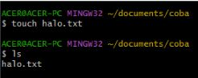

# Week 1

## Unix Command Line
- ### Shell
    Shell adalah processor makro atau penerjemah command language yang menerjemahkan perintah, yang ditulis oleh pengguna di terminal, ke dalam tindakan sistem yang dijalankan, yang juga dapat secara otomatis dijalankan dalam program yang disebut Shell Scripting. </br></br>
- ### FileSystem 
    Mengatur bagaimana data disimpan dalam suatu sistem. Sistem operasi Windows & Unix-like menyusun file dan direktori menggunakan struktur yang bentuknya mirip tree </br></br>
- ### Command Line Interface
    Sebuah antarmuka pengguna berbasis teks ( UI ) yang digunakan untuk menjalankan program, mengelola file komputer, dan berinteraksi dengan komputer. </br>
    Cara mengakses CLI menggunakan GitBash 
    1. Download dan Instal GitBash
    2. buat folder dalam local computer <br>
          </br>
    3. Klik kanan, pilih git bash here<br>
         </br>
    4. Siap digunakan <br>
         </br></br>
- ### Perintah dalam CLI 
    Berikut merupakan beberapa perintah dan fungsinya dalam CLI 
    1. cd -> berfungsi untuk pindah folder <br>
         </br>
    2. pwd -> berfungsi untuk melihat current working directory <br>
         </br>
    3. ls -> berfungsi untuk melihat isi folder <br>
         </br>
    4. touch -> berfungsi untuk membuat file baru <br>
         </br>
    5. mkdir -> berfungsi untuk membuat directory baru <br>
         </br>
    6. rm -> berfungsi untuk menghapus file <br>
         </br>
    7. rmdir -> berfungsi mengahpus directory <br>
         </br>
    8. mv -> berfungsi untuk memindahkan file <br>
         </br>
        mv juga dapat berfungsi untuk rename sebuah file <br>
         </br>
<hr></br>

## Git & GitHub
Git & Github sangat penting untuk Programmer. Merupakan sebuah alat (tools) yang digunakan dalam pengembangan software. Git & Github adalah version control system yang dapat mencatat setiap perubahan pada file proyek yang dikerjakan oleh banyak orang maupun sendiri. Git dan GitHub juga git digunakan untuk kolaborasi.

- ### Git vs. GitHub (Perbedaan)
    - Git </br>
        merupakan software berbasis Version Control System (VCS) yang bertugas untuk mencatat perubahan seluruh file atau repository suatu project. Git harus di instal didalam penyimpanan lokal, Berfokus pada version control dan code sharing, Akses secara offline, dan Tidak menggunakan fitur user management
    - GitHub </br>
        layanan cloud yang berguna untuk menyimpan dan mengelola sebuah project yang dinamakan repository (repo git). Cara kerja pada GitHub harus terkoneksi pada internet sehingga tidak perlu meng-install sebuah software ke dalam perangkat keras. Host melalui layanan cloud, Berfokus pada source code hosting terpusat, Akses secara online, dan Menggunakan user management
    
- ### Membuat Repository Git dari folder local komputer 
    1. Buat folder di local komputer <br>
        </br>
    2. masuk ke folder tersebut, kemudian klik kanan pilih "Git Bash Here" <br>
        </br>
    3. ketikan git init. Sekarang folder yang dibuat tadi sudahh menjadi repository <br>
        </br>
    4. masuk ke website git lalu klik "new repository" <br>
        </br>
    5. lalu ketikkan "git remote add origin https://github.com/(username)/(repository yang dibuat).git" Untuk me-remote ke github <br>
        </br>
    
- ### Melakukan Git Commit
    1. Buat sebuah file <br>
        </br>
    2. Ketikkan "git add ." untuk melacak perubahan <br>
        </br>
    3. Kemudian baru ketikkan "git commit -m "(pesan perubahan)" untuk melakukan commit <br>
        </br>

- ### Publish file ke GitHub 
    1. Ketikkan "git push -u origin (branch yang dipakai)" <br>
        
    2. File sudah terpublish ke GitHub <br>
        

- ### Clone GitHub Repository kedalam lokal komputer
    1. buka repository yang ikin di cloning, kemudian klik code dan salin kode tersebut <br>
        </br>
    2. pilih penyimpanan lokal pada komputer, kemudian klik kanan dan pilih "Git Bash Here" <br>
        <br>
    3. Ketikkan "git clone (link yang tadi dicopy)"<br>
        <br>
    4. file yang ada di GitHub sudah selasai di cloning ke lokal komputer<br>
        <br>

<hr><br>

## HTML 

- ### Apa itu HTML?
    HTML (Hypertext Markup Language) berfungsi untuk memuat konten kedalam browser. HTML bukan sebuah bahasa pemrograman, sifatnya statis jadi tidak dapat digunakan untuk mengolah data. HTML adalah sebuah kerangka dari website yang dibuat.
    <br><br>
- ### Tools 
    Untuk memulai membuat kerangka website dengan HTML dibutuhkan tools yang dapat mendukung pengembangannya. Tools yang dibutuhkan yaitu :
    1. Web Browser (Chrome, Mozila Firefox, Microsoft Edge, Opera, dll)
    2. Code Editor (Visual Studio  Code)
    </br></br>
- ### Kerangka HTML 
    Berikut merupakan contoh kerangka HTML sederhana 
    ```HTML
    <!DOCTYPE html>
        <html lang="en">
        <head>
            <meta charset="UTF-8">
            <meta http-equiv="X-UA-Compatible" content="IE=edge">
            <meta name="viewport" content="width=device-width, initial-scale=1.0">
            <title>Document</title>
        </head>
        <body>
            <h1>Hello World</h1>
        </body>
    </html>
    ```

    Berikut merupakan contoh tampilan dari kerangka HTML tersebut. </br>

    </br></br>

- ### Tag HTML 
    Tag HTML adalah sebuah penanda untuk konten HTML. Tag dibuat dengan kurung siku (<...>), lalu di dalamnya berisi nama tag dan kadang juga ditambahkan dengan atribut. Terdapat tag yang berpasangan, dan juga tag yang hanya berdiri sendiri. 

    Contoh Tag HTML
    - Untuk memasukkan gambar 
        ``` HTML
        
        ```
        Hasilnya yaitu </br>

        </br></br>

    - Formatting Text 
        ```HTML 
            <b>Hello</b><i>World</i>
            <u>Hello World</u>
        ```
        Hasilnya yaitu  
        <b>Hello</b> <i>World</i> </br>
        <u>Hello World</u></br></br>
    
    - Membuat List 
        - Unorder List
            ```HTML
            <ul>
                <li>Nasi Goreng</li>
                <li>Mie Goreng</li>
                <li>Kwetiau</li>
                <li>Nasi Bebek</li>
            </ul>
            ```
            Hasilnya yaitu 
            <ul>
                <li>Nasi Goreng</li>
                <li>Mie Goreng</li>
                <li>Kwetiau</li>
                <li>Nasi Bebek</li>
            </ul> </br>
        - Order List
            ```HTML
            <ol>
                <li>Nasi Goreng</li>
                <li>Mie Goreng</li>
                <li>Kwetiau</li>
                <li>Nasi Bebek</li>
            </ol>
            ```
            Hasilnya yaitu 
            <ol>
                <li>Nasi Goreng</li>
                <li>Mie Goreng</li>
                <li>Kwetiau</li>
                <li>Nasi Bebek</li>
            </ol> 
            </br></br>

- ### Semantic HTML 
    Merupakan sebuah tag HTML yang nama tagnya mengandung arti dari konten tag HTML tersebut. Semantic HTML membantu developer agar lebih “Easy to Read and Understand”. Semantic HTML berfungsi untuk meningkatkan Accessibility, meningkatkan SEO, dan memudahkan mainatain.
    </br></br>

- ### Deploy 
    Merupakan sebuah proses untuk menyebarkan aplikasi yang telah dibuat agar dapat dilihat oleh orang lain. Untuk mendeploy sebuah website, kita dapat mengunggah kedalam server. Dalam case ini, kita dapat menggunakan Netlify. 

<hr></br>

## CSS

- ### Apa itu CSS
    CSS adalah sebuah bahasa yang digunakan untuk mendesain halaman website. Dengan CSS kita dapat kita bisa mengubah warna, menggunakan font custom, editing text format, mengatur tata letak, dan lainnya.
- ### Menyisipkan CSS 
    1. Inline CSS
        Menambahkan CSS pada attribute element HTML. <br>
        ```CSS 
        <h1 style="color:blue; font-weight:bold;">Halo semuanya!</h1>
        ```
        Hasilnya akan seperti ini
        <h1 style="color:blue; font-weight:bold;">Halo semuanya!</h1>
    2. Internal CSS
        Menambahkan tag style pada head di file HTML.
        ```HTML
        <!DOCTYPE html>
            <html lang="en">
            <head>
                <meta charset="UTF-8">
                <meta http-equiv="X-UA-Compatible" content="IE=edge">
                <meta name="viewport" content="width=device-width, initial-scale=1.0">
                <title>Document</title>

                <style>
                    h1 {
                        color : red;
                        font-weight: bold;
                    }
                </style>

            </head>
            <body>
                <h1>Hello World</h1>
            </body>
        </html>
        ```
        Hasilnya akan seperti ini <br>
        <br>
    3. Eksternal CSS
        Digunakan jika kita membutuhkan banyak code pada CSS, direkomendasikan untuk memisahkan code CSS di file tersendiri (extension .css) dan terpisah dari file HTML.
        <br>
        cara untuk menghubungkan eksternal css dengan cara memberikan tag link pada HTML 
        ```html
        <link rel="stylesheet" href="style.css">
        ```

- ### Sintaks dasar CSS
    ```CSS
    h1 {
    color : red;}
    ```
    - berdasarkan kode di atas h1 adalah selector points yang ingin diubah
    - color : red;" adalah declaration
    - setiap declaration terdapat nama properti dan nilainya "color" sebagai properti "red" sebagai nilainya.

- ### Styling CSS 
    ```html

    ```
                
- ### Flexbox 
     merupakan mode layout yang ada di CSS3 dan digunakan untuk mengatur elemen di suatu halaman web.Bertujuan untuk memberikan container kemampuan untuk mengatur panjang, lebar, dan posisi item-item yang berada di dalamnya agar memaksimalkan ruang yang ada. Flexbox memiliki 1 parent/container dan bisa beberapa child/item.

     - #### Property Container pada Flexbox
        1. Flex Direction <br>
        properti flex-direction digunakan untuk mengatur letak item child ada 4 value flex-direction, yaitu:
            - row (default): secara default letak item child membentuk sebuah baris dari kiri ke kanan. <br>
                <br>
            - row-reverse: letak item child membentuk sebuah baris dari kanan ke kiri <br>
                <br>
            - column: letak item child membentuk sebuah baris dari atas ke bawah <br>
                <br>
            - column-reverse: letak item child membentuk sebuah baris dari bawah ke atas <br>
                <br>
        2. Flex Wrap <br>
        flex secara default akan membuat tata letak item children dalam 1 line saja. flex akan menyesuaikan space yang ada. Namun jika ingin membatasi jumlah item children dalam 1 line lalu item children yang lain akan pindah ke posisi line yang baru, maka kita bisa menggunakan flex-wrap. 
            - no-wrap (default): secara default, flex tidak menggunakan flex-wrap <br>
                <br>
            - wrap: flex item akan memiliki beberapa line dari atas ke bawah jika space dalam 1 line sudah full width. <br>
                <br>
            - wrap-reverse: kebalikan dari wrap yaitu lex item akan memiliki beberapa line dari bawah ke atas jika space dalam 1 line sudah full width <br>
                <br>
        3. Flex Flow
        properti flex-flow digunakan sebagai shortcut untuk set up flex-direction dan flex-wrap bersamaan. <br>
            - row nowrap <br>
                <br>
            - column wrap <br>
                <br>
            - column reverse <br>
                <br>
            - row-reverse wrap-reverse <br>
                <br>
<hr></br>

## Algoritma dan Struktur Data 

- ### Pengertian Algoritma
    Merupakan langkah – langkah yang dibuat untuk memecahkan suatu masalah. Sebuah Algoritma dikatakann berkualitas jika memenuhi beberapa syarat, yaitu:
    1. Input dan output harus didefinisikan terlebih dahulu dengan tepat
    2. Setiap step harus benar-benar clear dan tidak ambigu
    3. Algoritma seharusnya tidak mengandung suatu code pada bahasa pemograman tertentu. Algoritma harus dibuat agar dapat digunakan dalam bahasa pemograman apapun.
    </br></br>
-	### Kenapa harus tahu algoritma? (Algoritma vs Data Structure?)
    Programming itu adalah algoritma dan struktur data
    Data struktur digunakan untuk mengelola/manajemen sebuah data Dan Algoritma yang akan menyelesaikan suatu permasalahan menggunakan data tersebut. </br></br>
-	### Contoh Algoritma sederhana 
    Membuat algoritma dari kalkulator penambahan 
    1. Step 1: Mulai 
    2. Step 2 : Deklarasi variable angka_1, angka_2
    3. Step 3 : Membaca nilai dari variable angka_1 dan angka_2
    4. Step 4 : Panggil dan lakukan penambahan pada variable sum   (sum = angka_1 + angka_2)
    5. Step 5 : Menampilkan hasil sum 
    6. Step 6 : Selesai </br> 

    Berikut merupakan contoh penerapan algoritma diatas dalam JavaScript 
    ```JavaScript
        let angka_1, angka_2
        angka_1 = 3
        angka_2 = 5
        sum = angka_1 + angka_2 
        console.log(sum) //output : 8
    ```


<hr><br>

## Introduction to JavaScript 
-	### JavaScript?
    Bahasa Pemrograman yang digunakan untuk logic pada sebuah website. Dengan menggunakan JavaScript, dapat membuat website menjadi interaktif dan dinamis. </br></br>
-	### Menjalankan JavaScript
    Dapat dilakukan melalui browser (Chrome, Mozila Firefox, Microsoft Edge, Opera, dll)</br></br>
-	### Tipe Data dalam JavaScript
    Merupakan pengelompokan yang diberikan untuk berbagai macam data dalam yang digunakan dalam programming. Terdapat 6 Tipe data dasar dalam JavaScript, yaitu : 
    1.	Number -> tipe data yang memuat angka termasuk angka desimal
    2.	String -> grup karakter yang ada pada keyboard laptop/PC kita yaitu letters (huruf), number (angka), spaces (spasi), symbol, dan lainnya.
    Harus diawali dan diakhiri dengan single quotes ‘ … ‘ ataupun double quotes “ … “.
    3.	Boolean -> hanya mempunyai 2 nilai (true/false)
    4.	Null -> mengartikan bahwa sebuah variable/data tidak memiliki nilai
    5.	Undefined -> mengartikan variable/data tidak memiliki nilai
    6.	Object -> tipe data object adalah koleksi data yang saling berhubungan (related). Tipe data pbject dapat menyimpan data dengan tipe data apapun (number, string, boolean, dan lainnya). Tipe data object mempunyai key dan value.</br></br>
-	### Operator 
    1.	Assignment (=)
        Menyimpan sebuah nilai dalam variable <br>
        ```JavaScript
        let angka = 1;
        ```
    2.	Mathematical Assignment Operator
        ```JavaScript
        let a = 4;
        a = a+1
        console.log(a); //output 5
        ```
        Dapat disederhanakan menjadi 
        ```
        let a = 4;
        a += 1
        console.log(a); //output 5
        ```
    3.	Increment dan Decrement 
        Digunakan untuk menambah atau mengurangi sebuah nilai. Banyak tambah/kurangnya yaitu 1 
        ```JavaScript
        let a = 4;
        a++;
        console.log(a); //output 5
        ```
        ```JavaScript
        let a = 4;
        a--;
        console.log(a); //output 3
        ```
    4.	Arithmetic Operator 
        Merupakan operator yang melibatkan operasi matematika 
        -	Tambah (+)
        -	Kuramg (-)
        -	Perkalian (*)
        -	Pembagian (/)
        -	Modulus (%)
        ```JavaScript
        console.log(7 + 3) // output : 10
        console.log(2 - 1) // output : 1
        console.log(5 * 2) // output : 10
        console.log(15 / 3) // output : 5
        console.log(8 % 2) // output : 0  
        ```
    5.	Comparison 
        Operator yang membandingkan dua nilai. Hasilnya akan bersifat true atau false. 
        -	Lebih kecil dari : <
        -	Lebih besar dari: >
        -	Lebih kecil atau sama dengan: <=
        -	Lebih besar atau sama dengan: >=
        -	Sama dengan: ===
        -	Tidak sama dengan: !==
        ```JavaScript
        1 < 2 // output : True
        1 > 2; // output : False
        "Apple" === "Jeruk" // output : False
        "Apple" !== "Jeruk" // output : True 
        ```
    6.	Logical Operator 
        Digunakan untuk sebuah conditional. Akan menghasilkan nilai Boolean (true/false)
        -	AND operator : &&
        ```JavaScript
        console.log(true && true) // output : true 
        console.log(true && false) // output : false
        console.log(false && false) // output : false  
        ```
        -	OR operator: ||
        ```JavaScript
        console.log(true || true) // output : true 
        console.log(true || false) // output : true
        console.log(false || false) // output : false   
        ```
        -	NOT operator: !
        ```JavaScript
        let tahu = true;
        console.log(!tahu) // output : false
        ```
        </br></br>
- ### Control Flow 
    1. Kondisional 
        Merupakan sebuah percabangan dalam suatu kondisi. Cara kerjanya yaitu conditional statement akan mengecek suatu kondisi spesifik dan menjalankan perintah berdasarkan kondisi tersebut. 
        - If statement 
            ```JavaScript
            if (true){
                console.log("pesan ini akan muncul") 
            }
            // output : prints "pesan ini akan muncul"
            
            if (false){
                console.log("tidak terjadi apa apa")
            }
            ```
            Contoh IF statement 
            ```JavaScript 
            let haus = true;
            if (haus){
                console.log("minum")
            }
            // output : prints "minum"
            ```
        - if.. else...
            ```JavaScript 
            let haus = false;
            if (haus){
                console.log("minum")
            } else {
                console.log("ga dulu")
            }
            ```
        - if.. else if...
            ```JavaScript
            let keadaan = "haus"; 
            if (keadaan == "haus"){
                console.log("minum dulu dong")
            } else if (keadaam == "laper"){
                console.log("makan dulu gih")
            } else {
                console.log("tidur aja kali ye")
            }
            ```
        - switch case 
            switch case digunakan jika kondisi dan percabangan terlalu banyak
            ```JavaScript 
            let hitung = 2;
            switch (hitung){
                case 1 : console.log("hitungan ke - "+ hitung)
                break;
                case 2 : console.log("hitungan ke - "+ hitung)
                break;
                case 3 : console.log("hitungan ke - "+ hitung)
                break;
                case 4 : console.log("hitungan ke - "+ hitung)
                break;
                case 5 : console.log("hitungan ke - "+ hitung)
                break;
                default : console.log("dah gaada apa2")
            } // output : hitungan ke - 2
            ```
        - Ternary Option 
            merupakan short-syntax dari if.. else
             ```JavaScript
             let hujan = true;
            hujan ? console.log("Bawa Payung") : console.log("panas cuy");
            // output : prints "bawa payung"
             ```

    </br>

    2. Looping 
        Looping adalah statement yang mengulang sebuah instruksi hingga kondisi terpenuhi atau jika kondisi stop/berhenti tercapai.
        - for loop 
            ```JavaScript
            let a = 1;
            for (a; a <= 5; a++){
                console.log(a)
            } //output : 
                // 1
                // 2
                // 3
                // 4
                // 5
            ```
        - while 
            Perulangan ini sama saja dengan while. Tapi while digunakan untuk kondisi dimana kita tidak mengetahui jumlah pasti pengulangan.
            ```JavaScript 
            let warga = 2;
            let i;
            while (i <= jumlah warga){
                console.log("tampilkan data warga ke - " + warga)
                i++;
            }
            ```
        - Do While
            Statement akan dikerjakan terlebih dahulu baru pengecekan kondisi
            ```JavaScript
            let makanan = 5;
            do {
                console.log("makan dulu lah, masi ada makanan")
                makanan--;
            } while (makanan = 0){
                console.log("makanan lu dah habis, lu sih makan mulu")
            }
            ```
        - Nested Loop 
            Membuat perulangan dalam perulangan 
            ```JavaScript 
            for (let i = 0; i <= 10; i++){
                for (let j = 1; j <= i; j++){
                    console.log("baris" + i)
                    console.log("kolom" + j)
                }
            }
            ```


