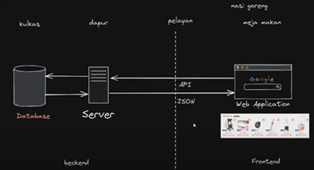
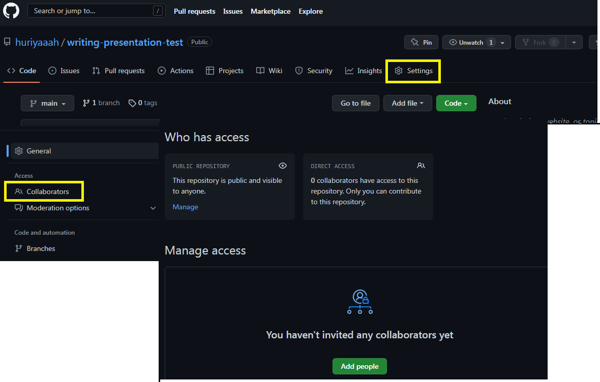

# Writing Week 4

## Asynchronous - Async Await 
- ### Apa itu async await 
    Merupakan cara lain untuk menangkap objek promise. Fitur ini mempermudah kita dalam menangani proses asynchronous.Async/Await merupakan sebuah syntax khusus yang digunakan untuk menangani Promise agar penulisan code lebih efisien dan rapih. Contoh 
    ```JavaScript
        const getAllUser = async ()=> {
        const data = await getUser()
        console.log(data)
    }
    ```
    Contoh menjalankan code promise dengan menggunakan async Await 
    ```JavaScript 
        let nonton = (kondisi) => {
        return new Promise((resolve, reject) => {
        if (kondisi == “jalan”) {
        resolve(“nonton terpenuhi”)
        } reject(“batal nonton”)
        })
        }

        Async function asyncNonton() {
        try {
        ret result = await nonton()
        console.log(result);
        } catch (error) {
        console.log(“error”)
        }
        } 
        asyncNonton ()
    ```
- ### Error Handling
    Untuk menghandle error  Async/Await kita dapat menggunakan try catch di dalam function yang kita buat, sehingga jika terjadi error kita dapat menangkap errornya dalam block catch.
    ```JavaScript 
    const getAllUser = async ()=> {
        try {
            const result = await getUser()
            console.log(result)
        } catch (error) {
            console.log(error)
        }
    }
    ```

## Fetch
- ### Apa itu Fetch ?
    Fetch gunakan untuk mengambil data dan menampilkan data ke browser. Berfungsi untuk web dinamis yang datanya selalu berubah. Berikut merupakan ilustrasi mengenai fetch data API <br>
    
- ### Mengambil data API menggunnakan fetch 
    ```JavaScript
        fetch("https://digimon-api.vercel.app/api/digimon")
        .then(result => result.json())
        .then(result => {
        console.log(result)
        })
    ```
- ### Menampilkan data API dalam web
    ```JavaScript 
        listDigimon = document.getElementById("list-digimon")

        let getDataDigimon = async () => {
        let URL = "https://digimon-api.vercel.app/api/digimon"
        let response = await fetch(URL)
        let digimons = await response.json()

        // menampilkan 10 data digimon
        digimons.slice(0, 10).forEach((item, index) => {
            listDigimon.innerHTML += 
            `<div>
                
                <h3>${item.name}</h3>
            </div>`
        })aru jdi 
        }

        getDataDigimon()
    ```

### GitHub Kolaborasi
Terdapat dua user, A dan B ingin berkolaborasi 
1. User A membuat repository baru, kemudian menambahkan user B untuk collaborator dengan cara pergi ke settings > collaborators > tambahkan teman <br>
 <br>
2. User A dan user B membuat branch masing-masing, dengan command git branch nama_branch, kemudian masing-masing user pindah ke branch baru yang dibikin dengan command git checkout nama_branch
3. User A dan user B melakukan pull masing ke dalam branch masing-masing di local computer/laptop, dengan command git pull origin main
4. Misalkan user A ingin menambahkan file, maka user A membuat file terlebih dahulu, kemudian di push di branch user A, dengan command git push origin nama_branch
5. Kemudian user A melakukan pull request dan merge ke branch main, dengan cara yang sudah dijelaskan di materi sebelumnya.
6. Jika user B igin menambahkan file, maka user harus melakukan pull request kembali, agar nanti tidak ada error atau kesalahan.
7. Kemudian user B bisa melakukan push ke dalam branch nya.
8. User B kemudian melakukan pull request.
9. User B tidak perlu melakukan merge, dan yang melakukan merge adalah user A karena dia adalah pemimpinnya.
10. Ulangi dari langkah ke-4.

## Responsive Web Design 
- ### Apa itu ?
    Memungkinkan website dapat diakses dimanapun (device apapun), tampilannya tetap bagus dan enak dilihat

- ### Tools pendukung responsive web design 
    1. Menggunakan viewport
    Viewport : area website yang dapat diakses oleh user <br>
    Setting viewport : Otomatis keluar saat menggunakan html dengan cara ketikan ! kemudian enter. Atau <br>
    `<meta name="viewport">`
    2. Menggunakan Max-Width element
    misalnya menjadikan gambar lebih responsif
    ```HTML
    
    ```
    3. Menggunakan CSS relative unit
    relative length : em, rem, vw, vh, % (yg sering dipakai)
        - em : mengikuti ukuran huruf dari element dia berada. Nyari font size dengan parent element terdekat. Contoh : container dengan em nya
        - rem : mengikuti ukuran huruf dari root element (ukuran huruf html). Biasanya ukuran default html adalah 16px. Jadi 2rem = 2 x 16px = 32px
        - % : bergantung pada parent element
        - Vw : relatife 1% dengan lebar viewport.. 50vw = 50% dari lebar viewport
        - Vh : relatife 1% dengan tinggi viewport. 50vh = 50% dari tinggi viewport
    4. Membuat beberapa style bergantung pada jenis device
    Kata kunci : @media. Contoh :
    ``` CSS
        @media (max-width: 500px) {
        }
    ```
    Jika ukuran layar dibawah 500px maka style settingan didalam @media yang berlaku
    5. Menggunakan Flexbox dan Grid
    Flexbox, Satu arah entah samping(kanan-kiri) atau atas bawah
    Grid, Bisa kearah samping dan atas bawah

## Bootstrap 
- ### Pengguanan Bootstrap
    ketika kita ingin membuat website kita menjadi responsif dengan cara yang simple karena sudah ada templatenya dan tinggal dicopy paste untuk digunakan
- ### Bootstrap layout
    1. Breakpoint : sebagai acuan untuk menyesuaikan tampilan dalam berbagai ukuran viewport. Beberapa breakpoint pada bootstrap 5 sm, md, lg, xl, xxl
    2. Containers : layout basicnya bootstrap
        - Default Container
            Class container memiliki sifat yang responsive dan fixed-width, yang berarti lebarnya akan berubah pada setiap breakpoint
            ```HTML
                <div class="container">
                <!-- Content here -->
                </div>
            ```
        - Fluid Container
            Class container-fluid memiliki lebar yang sama dengan viewport
            ```HTML
                <div class="container-fluid">
                <!-- Content here -->
                </div>
            ```
        - Responsive Container
            ```HTML
                <div class="container-sm">100% wide until small breakpoint</div>
                <div class="container-md">100% wide until medium breakpoint</div>
                <div class="container-lg">100% wide until large breakpoint</div>
                <div class="container-xl">100% wide until extra large breakpoint</div>
                <div class="container-xxl">100% wide until extra extra large breakpoint</div>
            ```
    3. Grid
        Grid system membagi lebar halaman menjadi 12 bagian. Sehingga apabila menggunakan class col-8, maka lebarnya akan menjadi 8/12 atau 2/3 dari lebar halaman.
    4. Column 
        mengatur urutan posisi dan align
        Component pada bootstrap : 
        - Alerts
        - Breadcrumb
        - Buttons
        - Card
        - Modal
        - Navbar
        - Navs & tabs
        - Pagination <br>
        Content pada bootstrap
        - Reboot
        - Typography
        - Images
        - Tables
        - Figures